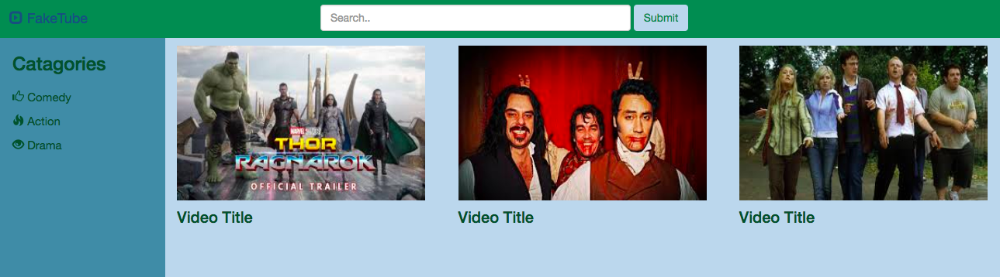
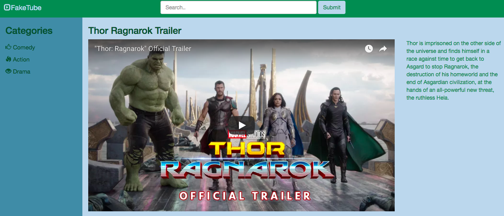

# Bootstrap-Group-Task

## Four page site using bootstrap.

**Subject**  
Video browsing site for movie trailers.


**GitHub Link**  
[Click here](https://github.com/WCWoolley/Bootstrap-Group-Task)

**How to download**  
Use Clone or Download link on GitHub main repo page.

**Challenges**  
We did not get all our universal code finished and styled before splitting into different feature branches, this caused us to have lots of conflicts when we tried to sync up.

**Some code snippets**  	

_Navbar code_  
HTML:

```
    <div class="row">
      <div class="col-md-12">
        <nav class="navbar">
          <div class="container-fluid">
            <div class="navbar-header">
              <a class="navbar-brand" href="../index.html"><span class="glyphicon glyphicon-expand"></span> FakeTube</a>
            </div>
            <form class="navbar-form navbar-right">
              <div class="form-group">
                <input type="text" class="form-control" placeholder="Search..">
              </div>
              <button type="submit" class="btn">Submit</button>
            </form>
          </div><!-- /.container-fluid -->
        </nav> <!--nav close -->
      </div> <!--column close -->
    </div> <!--row close -->
```

CSS:

```
.navbar{
  background: #0a8754;
  border-radius:0 0 5px 0;
  margin-bottom: 0;
}

.navbar-brand{
  color:#bfd7ea;
}

.form-control{
  background: #bfd7ea;
}
.navbar-form {
  margin-right: 30%;
}

.navbar-form .form-control{
  width:400px;
}

.btn{
  background: #bfd7ea;
  color: #0a8754;
}
```

**Images of site**  
<hr>

<hr>

<hr>
